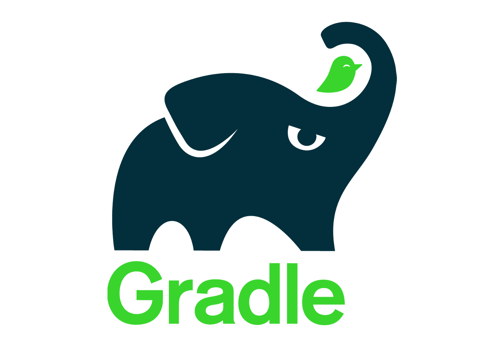
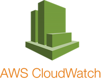
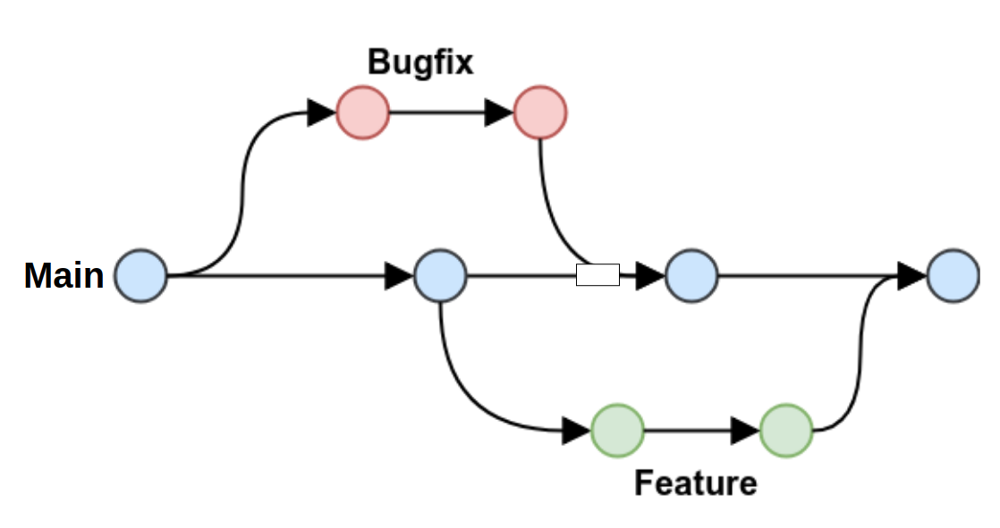

# 🎫 InterMark
  
프로그래머스 백엔드 마르코팀 - 인터파크 클론코딩 프로젝트

---

## 🧑‍🤝‍🧑 팀원 소개

| Product Owner | Scrum Master | Developer | Developer | Developer |
|------------|-----------|-----------|------|------|
| [권성준](https://github.com/Seongjun-Kwon)       | [이수영](https://github.com/twotwobread)     | [공태현](https://github.com/rhdtn311)     | [김소현](https://github.com/thguss)    | [박세준](https://github.com/park-se-jun) |
  
| Mentor | Sub Mentor |
|--------|------------|
| [마르코](https://github.com/ksy90101) | [김명환](https://github.com/samkimuel) |

## 프로젝트 목표

- 인터파크와 같은 티켓팅 서비스를 구현하는 목표를 가지고 있습니다.

## 개발 언어 및 활용기술

### 백엔드
|  |  | <code></code> |  |
|------------------------------------------------------------|---------------------------------------------------------------|------------------------------------------|------------------------------------------------------------|
| Java 17                                                    | Gradle                                                        | SpringBoot 2.7.7                              | Spring Data JPA                                            |

| <code></code> | <code></code> | <code></code> | <code></code>          | <code></code> |
|------------------------------------|------------------------------------------------------------------------------------------------------------------------------------------------------------------------------------|-----------------------------------------------------------------------------------------------------------------------------------------------------------------------------|-----------|------------------------------|
| Spring RestDocs                    | Junit 5                                                                                                                                                                            | Mockito                                                                                                                                                                     | MySQL 8.0 | Lombok                      |
### DevOps
|  |  |  |  |
|------------------------------------------------------------|-----------------------------------------------------------|------------------------------------------------------------|-------------------------------------------------------------------|
| AWS EC2                                                    | AWS S3                                                    | AWS RDS                                                    | AWS CloudWatch                                                    |

### 협업툴
| <code></code> |  |  |  |
|------------------------------|--------------------------------------------------------------|-------------------------------------------------------------|--------------------------------------------------------------|
| JIRA                         | Notion                                                       | Slack                                                       | Github                                                       |

## 브랜치 관리 전략
브랜치 관리 전략은 git flow를 사용합니다.
  
- develop : 개발 브랜치
- main : 프로젝트 초기 설정이 있는 브랜치
- 이슈마다 하나의 브랜치 생성 : 타입/Assignees_이슈번호 
  - ex) feat/홍길동_#13

## 프로젝트 페이지
[프로젝트 문서](https://www.notion.so/backend-devcourse/InterMark-73ab5e5458ce4955bb30c0f0e1b9c779)

### 회고
[프로젝트 회고](https://www.notion.so/backend-devcourse/09f71362f6954e88add62594a385358b)
