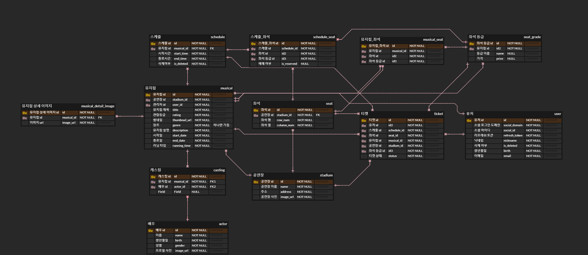

# 🎫 InterMark
  
프로그래머스 백엔드 마르코팀 - 인터파크 클론코딩 프로젝트

---

## 🧑‍🤝‍🧑 팀원 소개

| Product Owner                                                            | Scrum Master                                                            | Developer                                                               | Developer                                                              | Developer                                                             |
|--------------------------------------------------------------------------|-------------------------------------------------------------------------|-------------------------------------------------------------------------|------------------------------------------------------------------------|-----------------------------------------------------------------------|
|  |  |  |  |  |
| [권성준](https://github.com/Seongjun-Kwon)                                  | [이수영](https://github.com/twotwobread)                                   | [공태현](https://github.com/rhdtn311)                                      | [김소현](https://github.com/thguss)                                       | [박세준](https://github.com/park-se-jun)                                 |

| Mentor | Sub Mentor |
|--------|------------|
| [마르코](https://github.com/ksy90101) | [김명환](https://github.com/samkimuel) |

## 🥅 프로젝트 목표

- 인터파크와 같은 티켓팅 서비스를 구현하는 목표를 가지고 있습니다.
- 협업 경험이 없는 팀원들이 많은 만큼 협업에 대한 감을 잡고자 합니다.

## 🧰 개발 언어 및 활용기술

### 1. 백엔드
|  |  | <code></code> |  |
|------------------------------------------------------------|---------------------------------------------------------------|------------------------------------------|------------------------------------------------------------|
| Java 17                                                    | Gradle                                                        | SpringBoot 2.7.7                              | Spring Data JPA                                            |

| <code></code> | <code></code> | <code></code> | <code></code>          | <code></code> |
|------------------------------------|------------------------------------------------------------------------------------------------------------------------------------------------------------------------------------|-----------------------------------------------------------------------------------------------------------------------------------------------------------------------------|-----------|------------------------------|
| Spring RestDocs                    | Junit 5                                                                                                                                                                            | Mockito                                                                                                                                                                     | MySQL 8.0 | Lombok                      |

### 2. DevOps

|  |  |  |  |
|------------------------------------------------------------|-----------------------------------------------------------|------------------------------------------------------------|-------------------------------------------------------------------|
| AWS EC2                                                    | AWS S3                                                    | AWS RDS                                                    | AWS CloudWatch                                                    |

|  |  |  |
|-------------------------------------------------------------------|---------------------------------------------------------------|----------------------------------------------------------------|
| Git Actions                                                       | Docker                                                        | Jacoco                                                         |

### 3. 협업툴

|  |  |  |
|--------------------------------------------------------------|-------------------------------------------------------------|--------------------------------------------------------------|
| Notion                                                       | Slack                                                       | Github                                                       |

## 🗺️ 프로젝트 기술 아키텍처
- 추후 추가할 예정.
## 🔗 ER Diagram

  

## 📜 API 정의서 및 문서화

- [API 정의서](https://www.notion.so/backend-devcourse/API-827d93da3bc24f72a8dde9552db46a30)는 링크를 통해 확인할 수 있습니다.
- API 문서화는 RestDocs를 이용했으며 `/document` url path로 접근 시 확인할 수 있습니다.

## 📄 프로젝트 페이지

- [프로젝트 페이지](https://www.notion.so/backend-devcourse/InterMark-73ab5e5458ce4955bb30c0f0e1b9c779)

### 1. 코드 관련 컨벤션

- 해당 [링크](https://www.notion.so/backend-devcourse/b4ad1ccf164b4e17852d81132ee54790b)에 코드 컨벤션 관련 사항 문서화 했습니다.

### 2. 깃 커밋 메시지 컨벤션

| [CHORE] | 코드 수정, 내부 파일 수정 |
| --- | --- |
| [FEAT] | 새로운 기능 구현 |
| [ADD] | FEAT 이외의 부수적인 코드 추가, 라이브러리 추가, 새로운 파일 생성 |
| [HOTFIX] | issue나 QA에서 급한 버그 수정에 사용 |
| [FIX] | 버그, 오류 해결 |
| [DEL] | 쓸모 없는 코드 삭제 |
| [DOCS] | README나 WIKI 등의 문서 개정 |
| [CORRECT] | 주로 문법의 오류나 타입의 변경, 이름 변경에 사용 |
| [MOVE] | 프로젝트 내 파일이나 코드의 이동 |
| [RENAME] | 파일 이름 변경이 있을 때 사용 |
| [IMPROVE] | 향상이 있을 때 사용 |
| [REFACTOR] | 전면 수정이 있을 때 사용 |
| [TEST] | 테스트 코드 추가 시 사용 |

### 3. 브랜치 관리 전략

- 브랜치 관리 전략은 git flow를 사용합니다.
  
- git을 이용한 협업에 능숙하지 못한 팀원들이 많아 최대한 적은 브랜치 개수를 이용하고자 했습니다.
  - develop : 개발 및 배포 브랜치
  - main : 프로젝트 초기 환경 브랜치
  - 각 이슈에 대한 브랜치를 생성합니다.
    - 타입/개발자이름_이슈번호 (이슈에 대한 브랜치 타입은 feature 하나로 통일했습니다.)
    - ex) feature/홍길동_#13

### 4. 회고

- [프로젝트 회고](https://www.notion.so/backend-devcourse/09f71362f6954e88add62594a385358b)

### 5. 프로젝트 중 공부하거나 고민한 사항에 대한 문서

- [프로젝트 문서화](https://www.notion.so/backend-devcourse/d03336619a6d40f08e8bf8353ad9386e)

### 6. 프로젝트 트러블 슈팅 문서

- [프로젝트 트러블 슈팅](https://www.notion.so/backend-devcourse/08a650ceaa7e4c4a8cf9f53f77d453b8)
